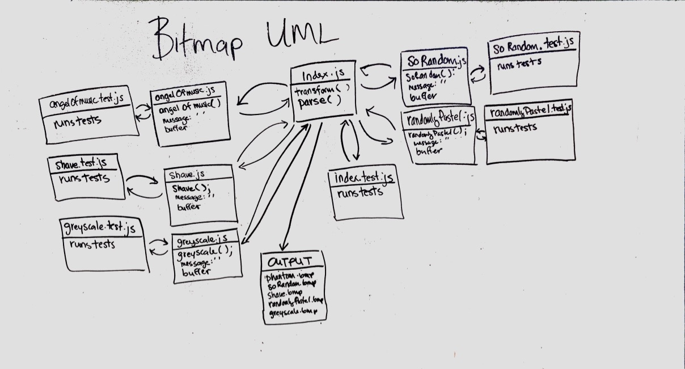

 LAB
=================================================

## Bitmap Transformer

### Author: Joseph Wolfe and Erin Trainor

### Links and Resources
* [PR](https://github.com/charmedsatyr-401-advanced-javascript/lab-05/pull/1)
* 

#### Documentation
* [jsdoc](./docs/index.html)

### Modules
#### `index.js`
#### `bitmap.js`
#### `angelOfMusic.js`
#### `greyscale.js`
#### `shave.js`
#### `soRandom.js`
#### `randomlyPastel.js`

##### Exported Values and Methods from `index.js`
`index.js` provides a command line interface for an instance of the `Bitmap` class instantiated with `./assets/bald.bmp`

##### Exported Values and Methods from `bitmap.js`
###### `Bitmap(filePath)` -> new instance of `Bitmap` class
 * `bitmap.js` exports a `Bitmap` class that takes a path to a bitmap file as an argument.
   * E.g., if `bald.bmp` exists in `./assets/`, a new instance `Bitmap` could be instantiated with the following: `const bitmap = new Bitmap('./assets/bald.bmp');`
 * Instances of `Bitmap` have `parse` and `transform` methods that operate on the file with which they were instantiated.

###### `parse()` -> `object`
  * The `parse` method asynchronously logs and returns an object with information about the file with which its `Bitmap` instance was instantiated.
  * The object will have the following keys and corresponding value types:
    * `type: String`
    * `fileSize: Number`
    * `bytesPerPixel: Number`
    * `height: Number`
    * `width: Number`
    * `colorPallet: Number`
    * `colorTable: Number`
    * `pixelArray: Number`

###### `transform(String)` -> `./transformations/[output].bmp`
  * The `transform` method takes a string argument.
  * It then stores a buffer read from the file with which its `Bitmap` instance was instantiated.
  * It invokes an external module determined by the string argument it received, using the stored buffer as the argument for the external module.
  * It expects the external module to return an object with the following keys and corresponding value types:
    * `buffer: [A modified version of the buffer]`
    * `message: String`
    * `output: [Filename ending with .bmp]`
  * `transform` then writes a file, using the received `buffer`, to a filename that corresponds to the received `output` value, in the `./transformations/` folder.
   * It then logs a message to the console that corresponds to the received `message` value.
  * If `transform` receives an invalid argument, it outputs an error message and an unmodified version of the file from which its `Bitmap` class was instantiated, as `error.bmp`.

##### Exported Values and Methods from `angelOfMusic.js`
###### `angelOfMusic(buffer)` -> `object`
  * `angelOfMusic` is a function that takes a buffer argument and returns an object with the following key-value pairs:
    * `buffer: [A modified version of the input buffer]`
    * `message: "Love me - that's all I ask of you."` 
    * `output: 'phantom.bmp'`
  * This module puts a "Phantom of the Opera" mask on the image in `./assets/baldy.bmp`

##### Exported Values and Methods from `greyscale.js`
###### `greyscale(buffer)` -> `object`
  * `greyscale` is a function that takes a buffer argument and returns an object with the following key-value pairs:
    * `buffer: [A modified version of the input buffer]`
    * `message: 'Where did all of the colors go?'` 
    * `output: 'greyscale.bmp'`
  * This module transforms the color pallet of `./assets/baldy.bmp` to greyscale.

##### Exported Values and Methods from `shave.js`
###### `shave(buffer)` -> `object`
  * `shave` is a function that takes a buffer argument and returns an object with the following key-value pairs:
    * `buffer: [A modified version of the input buffer]`
    * `message: 'Shaved John!'` 
    * `output: 'shaved.bmp'`
  * `shave` also logs `Ordered a shave!` to the console when invoked.
  * This module removes the facial hair from the image in `./assets/baldy.bmp`.

##### Exported Values and Methods from `randomlyPastel.js`
###### `randomlyPastel(buffer) -> `object`
  * `randomlyPastel` is a function that takes a buffer argument and returns an object with the following key-value pairs:    
    * `buffer: [A modified version of the input buffer]`
    * `message: 'I feel so colorfully faded'` 
    * `output: 'randomlyPastel.bmp'`
  * This module randomizes the colors of the image in `./assets/baldy.bmp` to pastel shades.

##### Exported Values and Methods from `soRandom.js`
###### `soRandom(buffer)` -> `object`
  * `soRandom` is a function that takes a buffer argument and returns an object with the following key-value pairs:
    * `buffer: [A modified version of the input buffer]`
    * `message: 'A Rainbox Exploded!'` 
    * `output: 'soRandom.bmp'`
  * This module randomizes the colors of the image in `./assets/baldy.bmp`.

#### Running the app
  * The app can be run out of the box on an instance of the `Bitmap` class created from `./assets/baldy.bmp`
    * `node index.js` (no string argument) -> invokes the `parse` method
    * The following commands can be used to invoke the `transform` method with functions exported from the indicated modules.
      * `angelOfMusic.js`
        * `node index.js 'angelOfMusic'`
        * `node index.js 'phantom'`
      * `greyscale.js`
        * `node index.js 'grayscale'`
        * `node index.js 'greyscale'`
      * `shave.js`
        * `node index.js 'shave'`
      * `soRandom.js`
        * `node index.js 'random'`
        * `node index.js 'soRandom'`
      * `randomlyPastel.js`
        * `node index.js 'pastel'`
        * `node index.js 'randomlyPastel'`
    * Error handling is triggered with any other argument, e.g., `node index.js Whoops`.
#### Tests
* How do you run tests?
  * `npm run test`
  * `npm run watch`
  * `npm run lint`
* What assertions were made?
  * `bitmap.js`
    * `parse()`
      * Should return an object
      * Should return an object with a `fileSize` key
      * Should return an object with a `fileSize` key that has a number value
      * Should return an object with a `bytesPerPixel` key
      * Should return an object with a `bytesPerPixel` key that has a  mber value       * Should return an object with a `height` key
      * Should return an object with a `height` key that has a number value
      * Should return an object with a `width` key
      * Should return an object with a `width` key that has a number value
      * Should return an object with a `colorPallet` key
      * Should return an object with a `colorPallet` key that has a number value
      * Should return an object with a `colorTable` key
      * Should return an object with a `colorTable` key that has a number value
      * Should return an object with a `pixelArray` key
      * Should return an object with a `pixelArray` key that has a number value
  * `angelOfMusic.js`, `greyscale.js`, `shave.js`, `randomlyPastel.js`, `soRandom.js`
    * Generic module tests
      * Input Tests
        * Should throw an error when it receives a string argument
        * Should throw an error when it receives a number argument
        * Should throw an error when it receives an array argument
        * Should throw an error when it receives a function argument
        * Should throw an error when it receives an undefined argument
        * Should throw an error when it receives a null argument
        * Should throw an error when it receives no argument
      * Output Tests
        * Should return an object with a `buffer` key
        * Should return an object with a `message` key
        * Should return an object with a `message` key that is a `string`
        * Should return an object with an `output` key
        * Should return an object with an `output` key that is a `string`
    * Module-specific tests
      * `shave.js`
        * Return an object with a buffer key that contains at least 156 `244` references
        * Should return defined when it receives a buffer of at least `4345` length, else it should throw an error.
      * `angelOfMusic.js`
        * Should return defined when it receives a buffer of at least `14428` length, else it should throw an error.
        * Return an object with a buffer key that contains `247` references between indices `14408` and `14428`.
      * `greyscale.js`
        * Should return defined when it receives a buffer of at least `1145` length, else it should throw an error.
        * Return an object where the buffer indices at `1144`, `1143`, and `1142` have been changed to the average of their values.
      * `soRandom.js`
        * Should return defined when it receives a buffer of at least `1145` length, else it should throw an error.
      * `randomlyPastel.js`
        * Should return defined when it receives a buffer of at least `1145` length, else it should throw an error.
* What assertions need to be / should be made?
  * `index.js`
    * The command line interface for `index.js`'s hardcoded `bitmap` instance has not been tested.
  * `bitmap.js`
    * `Bitmap` class requires input validation for invalid file paths.
    * `Bitmap.parse` and `Bitmap.transform` require testing to show proper integration of `fs.readFile`, and for error handling for `Bitmap` class instantiation with an invalid file path. They also need to be tested to ensure they `console.log` as desired.
    * `transform` requires general input and output validation, as well as testing to show proper integration of `fs.writeFile`.
    * `transform` requires error handling for cases when it invokes modules that do not return objects with the required structure. E.g., if `shave.js` returned an empty object after being invoked.
  * `soRandom.js` and `randomlyPastel.js` both use the package `faker` to randomize color values. More module-specific tests could be devised to ensure the desired level of randomization on the desired range.

#### UML
* N.B.: This UML diagram was drawn before we had fully implemented our code and is slightly outdated.

